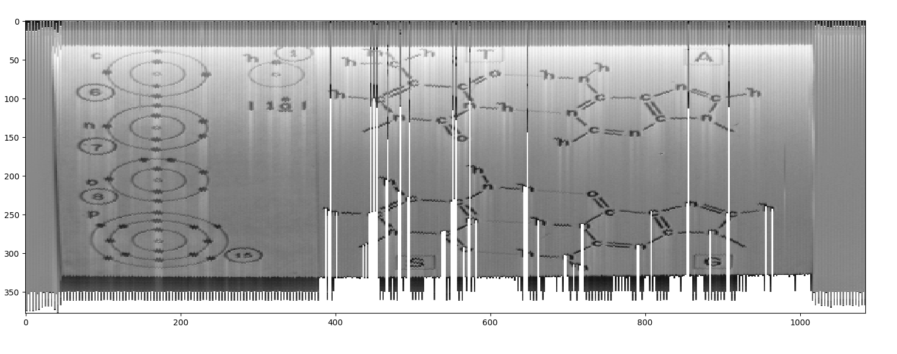

# Voyager image converter


## Introduction

In 1977 NASA sent two probes to space: Voyagers 1 and 2.
Both were destinated to leave the solar system and reach the unknown.

At the time, NASA asked Carl Sagan to create a message from Earth for whatever or whoever gets it. Sagan built a golden disc with some Earthian music such as Beethoven and Johnny B. Goode and sent some images encoded as sounds.

The cover of the disc is an auxiliar message, to help to decode the hidden images inside it:


Well, it seems tough. Let's find out how to get those images out of here.


## Diving in

My first idea was to build something in Javascript. As this project's goal was not only to extract images for myself but to create a visual demonstration of how this process work, I imagined that I could do this whole process via browser - or at least simulating it in a browser.

Oh god, how naïve!

Supposing that each image has `512` pixels width and `384` pixels height, this would be `512 * 384 = 196.608` points to manage individually. That means I would have to iterate and manipulate an array of around 200.000 numbers. That would be not viable at all for running inside a browser.

At least I was smart enough to give up this idea quickly.

So, I would need another programming language. Something that would deal good with huge lists of numbers, something that could easily plot images and something light enough to run from any terminal (because I'm too lazy to create an interface, despite my ambicious plans).

I chose `python`. Only because I believed it would satisfy all the requirements, despite, honestly, I never had touched any python project that worthed mentioning, so this would be the first.

Hands on!


## Viewing the sound

Ron Barry built something like this in the past and made the .wav file public available (you can find it in the [about section](credits.MD)). I owe him a lot.  
Apart from that huge 1,5GB and roughly 8 minutes wav file, I could only find soundcloud and youtube samples of the audio and, honestly: they are useless. The data on the video was too compressed to extract anything from it.

That raw .wav is also not included in this project because it's fucking 1,5GB, I don't want to push github that much.

Opening the .wav in Audacity, we can find the file:


Do you see each one of those peaks? In every interval between them you have an image. If you are smarter than I am (and a bet you are, believe me), you will be much faster to notice that the left channel (top) and the right channel (bottom) are not synchronized: each channel have different images at different times.

Ok, let's check what the disc cover can tell us:


The first box represents how to read the data: it should be read from top to bottom, left to right, plotting the points in the sequence it displays.  
The second image could be read as the Brazil's flag without the diamond shape, and is the closest Brazil got to really go to space. But it's the calibration image, a simple shape for alien researchers to use as base to build their algorithms.  
They don't have ways to find that out, it's honestly not too obvious.

Ok. Now I have the sound wave and I have a sample result. Let's dig deeper.


## Extracting the sample

Here it goes, a 5-second extraction from the first piece of wave of the left channel:


Hey, look at that! You can see the circle over there. Can you see it? Are you excited? Oh boy, I was singing Disney songs and drinking beer alone all night long after I saw that (although I don't think it was related to this project).

Let's see what the disc cover has to say about that:


Ok... Does that mean I should read every three waves to build a column of pixels? That was my initial thought. But no, this would give me too few columns to make a decent image by my accounts.

Let's zoom the .wav:

")

Ok, looking closely we can see that the shape between the peaks start as a single wave and splits in two... exploring further, it gets closer again after merging in a single wave once more. If we think on every column of pixels required to build a circle, we could assume that every interval between peaks can represent a column of pixels.

I used Audacity to export a single wave set of points in .txt files and then used the script inside `voyager.py` to examine and play around with the points, plotting the final result with `matplotlib` python library.

Let's divide the amount of time in the wav by the amount of columns and...


Shit, this does not look good.  
Time to drink whisky and cry all night long listening to Coldplay (although I don't think it was related to this project).

What if instead of a fixed time for each wave, I made a dynamic way to calculate how long each column will take. Looking back at our .wav wave, we can, maybe, count the points between every deep valley and every top peak and plot the points in between.


Great!  
I mean, not great, but look there, you can kind of see the circle if you get drunk in the same syntony.

I used a value for the alghoritm to find out when a wave is in its peak and another value for the alghoritm to find out when it reached the bottom (no, it's not smart enough to find it by itself). Tweaking a little bit there and back and...


YES! I am a genius!  
Look at that! an almost-perfect egg. I am so excited that I post it to Instagram, can you believe how amazing this is?

Do you see that the egg ends abruptly? Well.. the reason for that is because I am exporting the points from the wav using Audacity and the application only allows me to plot the first million points in a .txt. A million points for a sound wave is a hell lot of things for any 3 minute-music, but not much when you are trying to build an image plotting out the points of every 9 milisseconds wave in an y-axis.

Shit!
Well, Let's take a look what we have here in the second piece of audio.  
Pure gibberish.

I got the calibration image but failed to get everything else.  
Will aliens face this same issue when finding the voyager?


## Starting all over again

Once more it was Luiz who gave me the directions: "Why are you using Audacity to export the points? Why don't you open the .wav directly on python?".  
Great question. Why? Well.. It's my first time, I didn't think I could do that on python. Stupid me.

Ok, so instead of creating a single huge python file, I decided to split the code because I was getting confused already. I created a new script `wav-analyze.py` to open wav files, read the points and save them in a .txt file for the main script to use it just as it was doing before.  
Once I was already there, I decided to use `wav-analyze.py` to filter some data as well, so I would have lighter .txt files.

I will examine the wave inside audacity, manually find the point where the image data begins, find the point where the image data ends and ask the script to save just that in-between data in a txt file.

Like this:
```
$ python3 wav-analyze.py [wav-file (inside wav folder)] [total duration (ms)] [image start (ms)] [image end (ms)]
```
example:
```
python3 wav-analyze.py left01-circle 5971 89 4500
```

I found out later that I didn't need to send the duration, there was a smart way to calculate it from python:
```
	sampleRate, data = wavfile.read('./wav/' + file + '.wav', 'r')
	duration = len(data)/sampleRate
```

I was plotting the final wave result as well because I was looking at it in the graph and deciding where I would say that were the peaks and valleys for the other script.

After generated the .txt I was using the `voyager.py` to get the points just like before... but something was not the same: the way I was plotting the points were not the same the way Audacity was doing. I still needed to work on that script a bit.

First thing: my generated txts were working with huge numbers for each point. I had to do something to adjust the colors on the final plot. So I created this function:
```
def normalizeColor(c, peak, valley):
	c = c - valley;
	c = c / peak * 100;
	return c;
```

As the valley is below zero, I substracted it from every point in order to throw everything in the positive numbers. Than I divide it all by the peak just to have smaller values to deal. Than I mutiply it by 100, I don't remember why, there's more than one week that I wrote this function, It might be wrong but I will not touch it right now.

The result was a disaster. I failed miserably. I couldn't even see the circle anymore. I was starting all over again.

I was almost gaving up when I had an eureka-moment while playing videogames: I don't need to check the valleys, I only need to check the peaks. There were some sections where the image data were going below the valley points, so I had to get them too.

I literally deleted the `parse_data` function and built it all over again. The main loop looks like this in the final version:
```
	for i in range(len(data)):
		d = data[i];
		if( d > peak ):
			if( len(wave_arr) > 100 ):
				print('wave ending at {} with {} points'.format(i, len(wave_arr)));
				wave_sizes.append(len(wave_arr))
				arr.append(wave_arr);
				arr.append(wave_arr);
			wave_arr = [];
		else:
			val = normalizeColor(d, peak, valley);
			wave_arr.append(val);

	del(arr[0]);
```

If the point I'm looking is above the peak value I will reset the wave or, if the wave has enough points to be considered a line in the final image, I will add them to the final array of points. I'm adding it twice to get larger images (it's cheating, I know). The `wave_sizes` was there only for statistics and debugging, I can remove it now, but it doesn't hurt. If the point is below the peak line, I will make that random math on it and append it to the current column array.

Holy crap. It worked. I still can't believe it. Look at me, NASA, I've done it!

There is another script called `callibaration.py` that will throw me some useful information I was using in the start to find out which value to use on the peak. I was not using it in the end but I left it here because it might be useful at any time.

As a last special touch, I also send the colormap for putting some nice effects on the final plots, I liked it.
```
python voyager.py [file name (inside ./data)] [peaks] [color]
```

## Using the script
I have a series of different working examples here:
[list of available commands](commands.MD)

You're invited to play around with this, play around with the wavs, play around with the code, whatever. Fork it and play around, the world is yours.


## Images

Of course I will share some samples of the extracted images, I am proud of them.





## About and setup

I have a lot to thank during the small period of time that I worked with this.  
[Thank you, everyone!](credits.MD)


## Fork and contact

As I said, everybody is invited to play with this code.  
Fork it and ping me about your progress, I will be excited to see it.

If you built anything in any other language regarding the same project, let me know as well! =)

